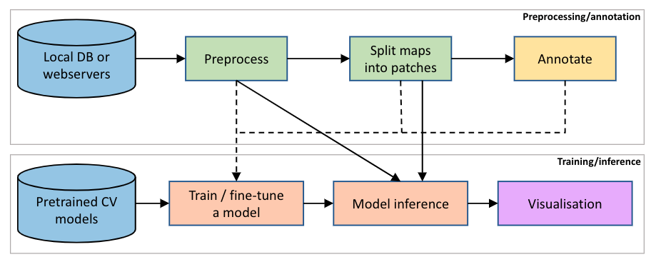

<div align="center">
    <br>
    <p align="center">
    <h1>MapReader</h1>
    </p>
    <h2>A computer vision pipeline for the semantic exploration of maps at scale</h2>
</div>
 
<p align="center">
    <a href="https://github.com/Living-with-machines/MapReader/workflows/Continuous%20integration/badge.svg">
        
    </a>
    <a href="./LICENSE">
        
    </a>
    <br/>
</p>

MapReader is an end-to-end computer vision (CV) pipeline designed by the [Living with Machines](https://github.com/Living-with-machines) project. It has two main components: preprocessing/annotation and training/inference:

<p align="center">
  
</p>

MapReader provides a set of tools to:

- **load** images/maps stored locally or **retrieve** maps via web-servers (e.g., tileservers which can be used to retrieve maps from OpenStreetMap *OSM* or National Library of Scotland *NLS*). :warning: Refer to the [Credits and re-use terms](#credits-and-re-use-terms) section if you are using digitized maps or metadata provided by NLS. 
- **preprocess** images/maps (e.g., divide them into patches, resampling the images, removing borders outside the neatline or reprojecting the map).
- annotate images/maps or their patches (i.e. slices of an image/map) using an **interactive annotation tool**.
- **train, fine-tune, and evaluate** various CV models.
- **predict** labels (i.e., model inference) on large sets of images/maps.
- Other functionalities include:
    - various **plotting tools** using, e.g., *matplotlib*, *cartopy*, *Google Earth*, and [kepler.gl](https://kepler.gl/).
    - compute mean/standard-deviation **pixel intensity** of image patches.

Here is an example output of a MapReader CV model (see [MapReader's paper](XXX)):

<p align="center">
  
</p>

<p align="center">
<em>British railspace and buildings as predicted by a MapReader computer vision model. ~30.5M patches from ~16K nineteenthcentury OS map sheets were used. (a) Predicted railspace; (b) predicted buildings; (c) and (d) predicted railspace (red) and buildings (black) in and around Middlesbrough and London, respectively. MapReader extracts information from large images or a set of images at a patch-level, as depicted in the figure insets. For both railspace and buildings, we removed those patches that had no other neighboring patches with the same label in the distance of 250 meters.</em>
</p>

Table of contents
-----------------

- [Installation and setup](#installation)
  - [Set up a conda environment](#set-up-a-conda-environment)
  - [Method 1: pip](#method-1)
  - [Method 2: poetry (for developers)](#method-2)
- [Tutorials](./examples) are organized in Jupyter Notebooks as follows:
  - Classification
      - [classification_one_inch_maps_001](./examples/classification_one_inch_maps_001)
        * **Goal:** train/fine-tune PyTorch CV classifiers on historical maps.
        * **Dataset:** from National Library of Scotland: [OS one-inch, 2nd edition layer](https://mapseries-tilesets.s3.amazonaws.com/1inch_2nd_ed/index.html).
        * **Data access:** tileserver
        * **Annotations** are done on map patches (i.e., slices of each map).
        * **Classifier:** train/fine-tuned PyTorch CV models.
- [How to cite MapReader](#how-to-cite-mapreader)
- [Credits and re-use terms](#credits-and-re-use-terms)
  - [Digitized maps](#digitized-maps): MapReader can retrieve maps from NLS via tileserver. Read the re-use terms in this section.
  - [Metadata](#metadata): the metadata files are stored at [mapreader/persistent_data](./mapreader/persistent_data). Read the re-use terms in this section.

## Installation

### Set up a conda environment

We strongly recommend installation via Anaconda:

* Refer to [Anaconda website and follow the instructions](https://docs.anaconda.com/anaconda/install/).

* Create a new environment for `mapreader` called `mr_py38`:

```bash
conda create -n mr_py38 python=3.8
```

* Activate the environment:

```bash
conda activate mr_py38
```

### Method 1

* Install `mapreader`:

```bash
pip install git+https://github.com/Living-with-machines/MapReader.git
```

* We have provided some [Jupyter Notebooks to show how different components in MapReader can be run](./examples). To allow the newly created `mr_py38` environment to show up in the notebooks:

```bash
python -m ipykernel install --user --name mr_py38 --display-name "Python (mr_py38)"
```

* Continue with the [Tutorials](#table-of-contents)!

### Method 2

* Clone `mapreader` source code:

```bash
git clone https://github.com/Living-with-machines/MapReader.git 
```

* Install using [poetry](https://python-poetry.org/):

```bash
cd /path/to/MapReader
poetry install
poetry shell
```

* Continue with the [Tutorials](#table-of-contents)!

## How to cite MapReader

Please consider acknowledging MapReader if it helps you to obtain results and figures for publications or presentations, by citing:

```text
XXX
```

and in BibTeX:

```bibtex
XXX
```

## Credits and re-use terms

### Digitized maps

MapReader can retrieve maps from NLS (National Library of Scotland) via webservers. For all the digitized maps (retrieved or locally stored), please note the re-use terms:

:warning: Use of the digitised maps for commercial purposes is currently restricted by contract. Use of these digitised maps for non-commercial purposes is permitted under the [Creative Commons Attribution-NonCommercial-ShareAlike 4.0 International](https://creativecommons.org/licenses/by-nc-sa/4.0/) (CC-BY-NC-SA) licence. Please refer to https://maps.nls.uk/copyright.html#exceptions-os for details on copyright and re-use license.

### Metadata

We have provided some metadata files in `mapreader/persistent_data`. For all these file, please note the re-use terms:

:warning: Use of the metadata for commercial purposes is currently restricted by contract. Use of this metadata for non-commercial purposes is permitted under the [Creative Commons Attribution-NonCommercial-ShareAlike 4.0 International](https://creativecommons.org/licenses/by-nc-sa/4.0/) (CC-BY-NC-SA) licence. Please refer to https://maps.nls.uk/copyright.html#exceptions-os for details on copyright and re-use license.
