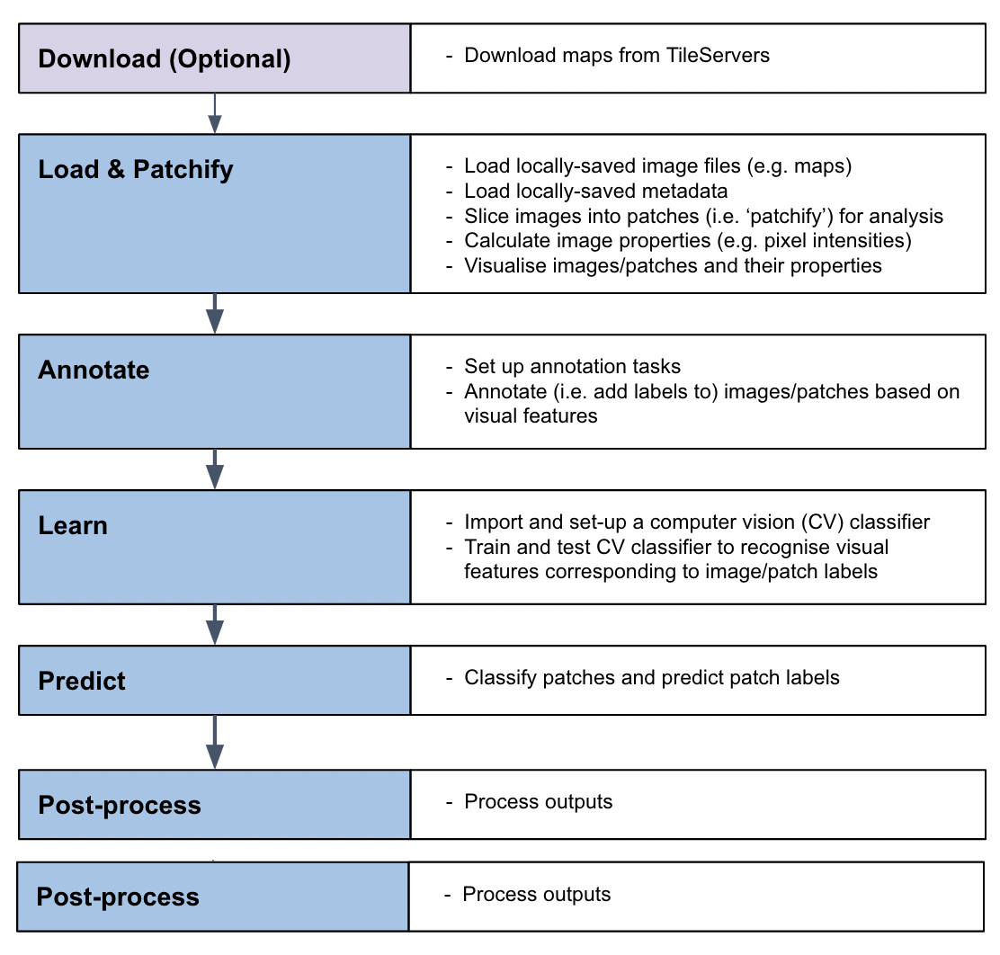

About MapReader
================

What is MapReader?
-------------------

MapReader is an end-to-end computer vision (CV) pipeline for exploring and analyzing images at scale.

What is unique about MapReader?
~~~~~~~~~~~~~~~~~~~~~~~~~~~~~~~~

MapReader is based on the 'patchwork method' in which whole map images are sliced into a grid of squares or 'patches':

.. image:: figures/patchify.png

This unique way of pre-processing map images enables the use of image classification to identify visual features within maps, in order to answer important research questions.

What is 'the MapReader pipeline'?
~~~~~~~~~~~~~~~~~~~~~~~~~~~~~~~~~~

The MapReader pipeline consists of a linear sequence of tasks:

Together, these tasks can be used to train a computer vision (CV) classifier to recognise visual features within maps and identify patches containing these features across entire map collections.

What kind of visual features can MapReader help me identify?
~~~~~~~~~~~~~~~~~~~~~~~~~~~~~~~~~~~~~~~~~~~~~~~~~~~~~~~~~~~~~~~~

In order to train a CV classifier to recognise visual features within your maps, your features must have a homogeneous visual signal across your map collection (i.e. always be represented in the same way).

Why use MapReader?
-------------------

MapReader becomes useful when the number of maps you wish to analyse exceeds the number which you (or your team) are willing/capable of annotating manually.

This exact number will vary depending on:

- the size of your maps, 
- the features you want to find,
- the skills you (or your team) have,
- the amount of time at your disposal.
 
Deciding to use MapReader, which uses deep learning computer vision (CV) models to predict the class of content on patches across many sheets, means weighing the pros and cons of working with the data output that is inferred by the model. 
Inferred data can be evaluated against expert-annotated data to understand its general quality (are all instances of a feature of interest identified by the model? does the model apply the correct label to that feature?), but in the full dataset there *will necessarily be* some percentage of error. 

MapReader creates output that you can link and analyze in relation to other geospatial datasets (e.g. census, gazetteers, toponyms in text corpora).

Who might be interested in using MapReader?
--------------------------------------------

MapReader might be useful to you if:

- You have access to a large collection of maps and want to identify visual features within them without having to manually annotating each map.
- You want to quickly test different labels to help refine a research question that depends on identifying visual features within maps before/without committing to manual vector data creation.
* Your maps were created before surveying accuracy reached modern standards, and therefore you do not want to create overly precise geolocated data based on the content of those maps.

What skills/knowledge will I need to use MapReader?
~~~~~~~~~~~~~~~~~~~~~~~~~~~~~~~~~~~~~~~~~~~~~~~~~~~~~

* Understanding of your map collection and knowledge of visual features you would like to identify within your maps
* Basic understanding of how to use your terminal
* Basic python
* Basic understanding of machine learning and computer vision (CV) methodology