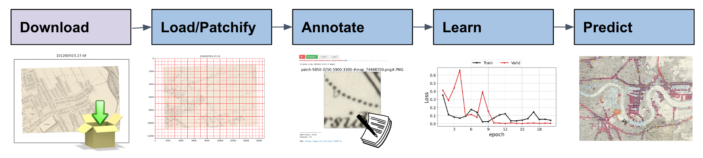

Input guidance
===============

.. contents:: 

Preparing your map corpus
--------------------------

How many maps?
~~~~~~~~~~~~~~~~

MapReader was designed to help researchers work with large collections of series maps. 
Deciding to use MapReader, which uses deep learning computer vision models to predict the class of content on patches across many sheets, means weighing the pros and cons of working with the data output that is inferred by the model. 
Inferred data can be evaluated against expert-annotated data to understand its general quality (are all instances of a feature of interest identified by the model? does the model apply the correct label to that feature?), but in the full dataset there *will necessarily be* some percentage of error. 

So, MapReader is useful when the number of maps you wish to analyze exceeds the number which you (or a team) might be willing and able to annotate manually, using tools like ArcGIS, QGIS, or web-based annotation interfaces like Recogito. 
This number will vary depending on the size of your maps, the features you want to find, the skills you and your team have, and the amount of time at your disposal. 

Input options
--------------

The MapReader pipeline is structured as follows:

The inputs you will need for MapReader will depend on where you begin within the pipeline.

Option 1 - If you want to download maps from a TileServer
~~~~~~~~~~~~~~~~~~~~~~~~~~~~~~~~~~~~~~~~~~~~~~~~~~~~~~~~~~~

If you want to download maps from a TileServer using MapReaders `Download` subpackage, you will need:

* A `json` file containing metadata for each map you would like to query/download. 
* The base URL of the map layer which you would like to access.

The key starting point is to be sure you have metadata for each map, or, "item-level" metadata in a json file. 
This allows every map file to be associated with its georeferencing information, title, publication date, or other basic information that you would like to be preserved and associated with patches.

You may have different kinds of metadata from different sources for your map files (e.g. descriptive or bibliographic metadata from a collection record, or technical metadata about georeferencing). 
We provide detailed guidance about requirements for your metadata file if you are working with maps from a Tile Server service.

.. comment: TODO add guidance about metadata requirement for other file types (not tile server) (Rosie) - need column in metadata that corresponds to image id in images object.

Option 2 - If your files are already saved locally
~~~~~~~~~~~~~~~~~~~~~~~~~~~~~~~~~~~~~~~~~~~~~~~~~~~

If you already have your maps saved locally, you can skip the 'Download' task and move straight to 'Load'.

If you would like to work with georeferenced maps, you will need either:

* Your map images saved as standard, non-georeferenced, image files (e.g. JPEG, PNG or TIFF) along with a separate file containing georeferencing metadata you wish to associate to these map images. **OR**
* You map images saved as georeferenced image files (e.g. geoTIFF).

Alternatively, if you would like to work with non-georeferenced maps/images, you will need:

* Your images saved as standard image files (e.g. JPEG, PNG or TIFF).

Recommended directory structure
--------------------------------

We reccomend setting up your files in the following directory structure:

::

    project
    ├──your_notebook.ipynb
    └──maps        
       ├── map1.png
       ├── map2.png
       ├── map3.png
       ├── ...
       └── metadata.csv
    
This is the directory structure created when using the default file paths set up within MapReader.

.. comment: TODO - Katie to add comment about user needing to have maps accessible either in cloud storage (Azure, etc.) or locally.

.. note:: Your map images should be stored in a flat directory. They **cannot be nested** (e.g. if you have states within a nation, or some other hierarchy or division).

Preparing your metadata
------------------------

MapReader uses file names as unique identifiers (`imageID`s) for your map images.
If you would like to associate metadata (e.g. georeferencing information, publication dates or any other information about your images) to these map images, then MapReader must be able to identify which image to associate each peice of metadata information.
This  means that, at minimum, your metadata must contain a column/header named `imageID` whose contents is the file names of your map images.

To load metadata into MapReader, your metadata must be in the form of either:

* A csv file **OR**
* A pandas dataframe

The simplest option is to save your metadata as a csv file (this can be created from an excel spreadsheet) and load it directly into MapReader.
However, `Pandas is able to read a number of different file formats <https://pandas.pydata.org/docs/user_guide/io.html>`_ so, if your metadata is saved in a different file format, you can use pandas to read your file, create a dataframe from it, and pass that dataframe to MapReader instead.