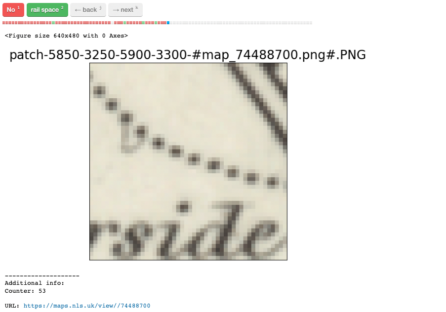
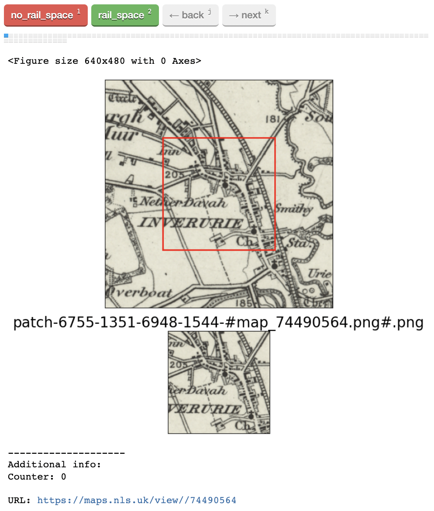

Annotate
=========

.. note:: You will need to update file paths to reflect your own machine's directory structure.

MapReader's ``Annotate`` subpackage is used to interactively annotate images (e.g. maps).

This is done in three simple steps: 

1. :ref:`Create_file`
2. :ref:`Annotate_images`
3. :ref:`Save_annotations`

.. _Create_file:

Create an annotation tasks file
-----------------------------------

To set up your annotation tasks, you will need to create a separate ``annotation_tasks.yaml`` file.
An example file which can be used as a template can be found in ``MapReader/worked_examples/``.

.. todo:: Note that you can do this via texteditor in windows or something like ??? in mac/linux

Your ``annotation_tasks.yaml`` file needs to contain two sections: ``tasks`` and ``paths``.
	
The ``tasks`` section is used to specify annotation tasks and their labels. 
This section can contain as many tasks/labels as you would like and should be formatted as follows:
	
.. code-block:: yaml
	
	tasks:
	  your_task_name: 
	    labels: ["your_label_1", "your_label_2", "your_label_3"]
	  your_task_name_2: 
		labels: ["your_label_1", "your_label_2"]

.. note:: When annotating, for each patch you will only be able to select one label from your label list. So, if you envisage wanting to label something as "label_1" **and also** "label_2", you will need to create a separate label combining "label_1 and label_2". 
	
The ``paths`` section is used to specify file paths to sets of images you would like to annotate (annotation sets). 
This section can contain as many annotation sets as you would like and should be formatted as follows:

.. code-block:: yaml

	paths:
	  your_annotation_set:
		patch_paths: "./path/to/patches/"
		parent_paths: "./path/to/parents/"
		annot_dir: "./path/to/save/annotations"
	  your_annotation_set_2:
		patch_paths: "./path/to/patches_2/"
		parent_paths: "./path/to/parents_2/"
		annot_dir: "./path/to/save/annotations_2"

For example, if you want to annotate 'rail_space' (as in `this paper <https://dl.acm.org/doi/10.1145/3557919.3565812>`_) and have been using the reccomended/default directory structure, your ``annotation_tasks.yaml`` should look like this: 
	   
.. code-block:: yaml

	#EXAMPLE
	tasks:
	  rail_space:
		labels: ["no_rail_space", "rail_space"]

	paths:
	  set_001:
		patch_paths: "./patches/patch-*png"
		parent_paths: "./maps/*png"
		annot_dir: "./annotations_one_inch"
		
.. _Annotate_images:

Annotate your images
----------------------

.. note:: Run these commands in a Jupyter notebook (or other IDE), ensuring you are in your `mr_py38` python environment.

To prepare your annotations, you must specify a ``userID``, ``annotation_tasks_file`` (i.e. the ``annotation_task.yaml``), tell MapReader which ``task`` you'd like to run and which  ``annotation_set`` you would like to run on. 

.. todo:: Give big list of different options here
.. todo:: Explain that things don't autosave

e.g. following our 'rail_space' example from earlier:

.. code-block:: python

	  #EXAMPLE
    from mapreader.annotate.utils import prepare_annotation

    annotation = prepare_annotation(
        userID="rosie",
        annotation_tasks_file="annotation_tasks.yaml",
        task="rail_space",
        annotation_set="set_001",
    )

You can then interactively annotate a sample of your images using:

.. code-block:: python

    annotation

To help with annotating, you can set the annotation interface to show a context image using ``context_image=True``. 
This creates a second panel in the annotation interface, showing your patch in the context of a larger region whose size, in pixels, is set by ``xoffset`` and ``yoffset``.

e.g. :
		
.. code-block:: python

	#EXAMPLE	
    annotation=prepare_annotation(
        userID="rosie", 
        annotation_tasks_file="annotation_tasks.yaml", 
        task="rail_space", 
        annotation_set="set_001", 
        context_image=True, 
        xoffset=100, 
        yoffset=100)

    annotation 

By default, your patches will be shown to you in a random order but, to help with annotating, can be sorted by their mean pixel intesities using ``sorby="mean"``. 
	
You can also specify ``min_mean_pixel`` and ``max_mean_pixel`` to limit the range of mean pixel intensities shown to you and ``min_std_pixel`` and ``max_std_pixel`` to limit the range of standard deviations within the mean pixel intensities shown to you. 
This is particularly useful if your images (e.g. maps) have collars or margins that you would like to avoid.

e.g. :

.. code-block:: python
		
    annotation=prepare_annotation(
        userID="rosie", 
        annotation_tasks_file="annotation_tasks.yaml", 
        task="rail_space", 
        annotation_set="set_001", 
        context_image=True, 
        xoffset=100, 
        yoffset=100, 
        min_mean_pixel=0.5, 
        max_mean_pixel=0.9
    )

    annotation 

.. _Save_annotations:

Save your annotations
----------------------
	
Once you have annotated your images, you should save your annotations using:

.. code-block:: python

	  #EXAMPLE
    from mapreader.annotate.utils import save_annotation

    save_annotation(
        annotation,
        userID="rosie",
        task="rail_space",
        annotation_tasks_file="annotation_tasks.yaml",
        annotation_set="set_001",
    )

This saves your annotations as a ``csv`` file in the ``annot_dir`` specified in your annotation tasks file.

For example, if you have downloaded your maps using the default settings of our ``Download`` subpackage or have set up your directory as reccommended in our `Input Guidance <https://mapreader.readthedocs.io/en/latest/Input-guidance.html>`__, and then saved your patches using the default settings:

::

    project
    ├──your_notebook.ipynb
    └──maps        
    │   ├── map1.png
    │   ├── map2.png
    │   ├── map3.png
    │   ├── ...
    │   └── metadata.csv
    └──patches
    │   ├── patch-0-100-#map1.png#.png
    │   ├── patch-100-200-#map1.png#.png
    │   ├── patch-200-300-#map1.png#.png
    │   └── ...
    └──annotations_one_inch
	    └──rail_space_#rosie#.csv

