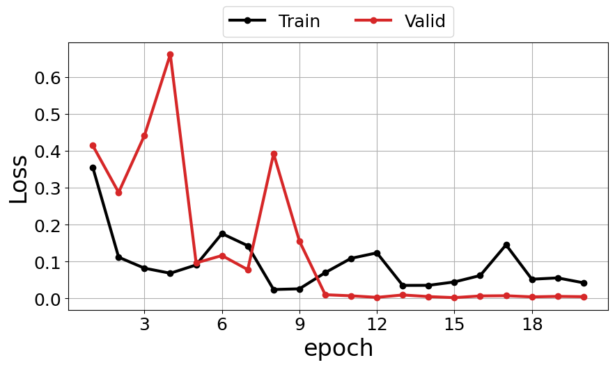

Train/fine-tune a classifier
==============================

If you are new to computer vision/ machine learning, `see this tutorial for details on fine-tuning torchvision models <https://pytorch.org/tutorials/beginner/finetuning_torchvision_models_tutorial.html>`__.
This will help you get to grips with the basic steps needed to train/fine-tune a model.

Load annotations and prepare data
-----------------------------------

Load and check annotations
~~~~~~~~~~~~~~~~~~~~~~~~~~~

First, load in your annotations using:

.. code-block:: python

    from mapreader import AnnotationsLoader

    annotated_images = AnnotationsLoader()
    annotated_images.load(annotations = "./path/to/annotations.csv")

For example, if you have set up your directory as recommended in our :doc:`Input Guidance </Input-guidance>`, and then saved your patches and annotations using the default settings:

.. code-block:: python

    #EXAMPLE
    annotated_images = AnnotationsLoader()
    annotated_images.load("./annotations/railspace_#rosie#.csv")

.. admonition:: Advanced usage
    :class: dropdown

    Other arguments you may want to specify when loading your annotations include:

    - ``delimiter`` - By default, this is set to "," so will assume your ``csv`` file is comma separated. You will need to specify the ``delimiter`` argument if your file is saved in another format.
    - ``id_col``, ``patch_paths_col``, ``label_col`` - These are used to indicate the column headings for the columns which contain image IDs, patch file paths and labels respectively. By default, these are set to "image_id", "image_path" and "label".
    - ``append`` - By default, this is ``False`` and so each call to the ``.load()`` method will overwrite existing annotations. If you would like to load a second ``csv`` file into your ``AnnotationsLoader`` instance you will need to set ``append=True``.

To view the data loaded in from your ``csv`` as a dataframe, use:

.. code-block:: python

    annotated_images.annotations

You will note a ``label_index`` column has been added to your dataframe.
This column contains a numerical reference number for each label, which is needed when training your model.

To see how your labels map to their label indices, call the ``annotated_images.labels_map`` attribute:

.. code-block:: python

    annotated_images.labels_map

.. note:: This ``labels_map`` will be needed later.

To view a sample of your annotated images use the ``show_sample()`` method.
The ``label_to_show`` argument specifies which label you would like to show.

For example, to show your "railspace" label:

.. code-block:: python

    #EXAMPLE
    annotated_images.show_image_labels("railspace")

.. todo:: update this pic

.. image:: ../../figures/show_image_labels_10.png
    :width: 400px

By default, this will show you a sample of 9 images, but this can be changed by specifying ``num_sample``.

When viewing your annotations, you may notice that you have mislabelled one of your images.
The ``.review_labels()`` method, which returns an interactive tool for adjusting your annotations, provides an easy way to fix this:

.. code-block:: python

    annotated_images.review_labels()

.. image:: ../../figures/review_labels.png
    :width: 400px

.. note:: To exit, type "exit", "end", or "stop" into the text box.

Prepare datasets and dataloaders
~~~~~~~~~~~~~~~~~~~~~~~~~~~~~~~~~

.. todo:: "Most neural networks expect the images of a fixed size. Therefore, we will need to write some preprocessing code." Add note about this is why we resize and also comment on square images.

Before using your annotated images to train your model, you will first need to:

.. _ratios:

**1.  Split your annotated images into "train", "val" and and, optionally, "test"** `datasets <https://pytorch.org/tutorials/beginner/basics/data_tutorial.html>`__\ **.**

    By default, when creating your "train", "val" and "test" datasets, MapReader will split your annotated images as follows:

    - 70% train
    - 15% validate
    - 15% test

    This is done using a stratified method, such that each dataset contains approximately the same proportions of each target label.

    .. admonition:: Stratified example
        :class: dropdown

        If you have twenty annotated images:

        - labels: ``"a","a","b","a","a","b","a","a","a","a","a","b","a","a","a","b","b","a","b","a"`` (14 ``"a"``\s and 6 ``"b"``\s)

        Your train, test and val datasets will contain:

        - train labels: ``"a","a","b","a","a","a","a","a","b","a","a","a","b","b"`` (10 ``"a"``\s and 4 ``"b"``\s)
        - val labels: ``"a","b","a"`` (2 ``"a"``\s and 1 ``"b"``)
        - test labels: ``"a","a","b"`` (2 ``"a"``\s and 1 ``"b"``)

.. _transforms:

**2.  Define some** `transforms <https://pytorch.org/vision/stable/transforms.html>`__ **which will be applied to your images to ensure your they are in the right format.**

    Some default image transforms, generated using `torchvision's transforms module <https://pytorch.org/vision/stable/transforms.html>`__, are predefined in the ``PatchDataset`` class.

    .. admonition:: See default transforms
        :class: dropdown

        **default transforms for training dataset**

        .. code-block:: python

            transforms.Compose(
                [
                    transforms.Resize((224,224)),
                    transforms.RandomApply([transforms.RandomHorizontalFlip(), transforms.RandomVerticalFlip()], p=0.5),
                    transforms.ToTensor(),
                    transforms.Normalize(normalize_mean, normalize_std),
                ]
            )

        **default transforms for val and test datasets**

        .. code-block:: python

            transforms.Compose(
                [
                    transforms.Resize((224,224)),
                    transforms.ToTensor(),
                    transforms.Normalize(normalize_mean, normalize_std),
                ]
            )

    You can access these by calling the ``.transform`` attribute on any dataset or from the ``PatchDataset`` API documentation.

.. _sampler:

**3.  Create** `dataloaders <https://pytorch.org/tutorials/beginner/basics/data_tutorial.html>`__ **which can be used to load small batches of your dataset during training/inference and apply the transforms to each image in the batch.**

    In many cases, you will want to create batches which are approximately representative of your whole dataset.
    This requires a `sampler <https://pytorch.org/docs/stable/data.html#data-loading-order-and-sampler>`__ with weights inversely proportional to the number of instances of each label within each dataset.

    By default, MapReader creates a sampler with weights inversely proportional to the number of instances of each label within the "train" dataset.

    .. admonition:: Sampler example
        :class: dropdown

        If you have fourteen images in your train dataset:

        - train labels: ``"a","a","b","a","a","a","a","a","b","a","a","a","b","b"`` (10 ``"a"``\s and 4 ``"b"``\s)

        The weights for your sampler will be:

        - ``"a"`` weights: 1/10 (one in ten chance of picking an ``"a"`` when creating a batch)
        - ``"b"`` weights: 1/4 (one in four chance of picking an ``"b"`` when creating a batch)

    Using a sampler to create representative batches is particularly important for imbalanced datasets (i.e. those which contain different numbers of each label).

To split your annotated images and create your dataloaders, use:

.. code-block:: python

    dataloaders = annotated_images.create_dataloaders()

By default, this will split your annotated images using the :ref:`default train:val:test ratios<ratios>` and apply the :ref:`default image transforms<transforms>` to each by calling the ``.create_datasets()`` method.
It will then create a dataloader for each dataset, using a batch size of 16 and the :ref:`default sampler<sampler>`.

To change the batch size used when creating your dataloaders, use the ``batch_size`` argument:

.. code-block:: python

    #EXAMPLE
    dataloaders = annotated_images.create_dataloaders(batch_size=24)

.. admonition:: Advanced usage
    :class: dropdown

    Other arguments you may want to specify when creating your dataloaders include:

    - ``sampler`` - By default, this is set to ``default`` and so the :ref:`default sampler<sampler>` will be used when creating your dataloaders and batches. You can choose not to use a sampler by specifying ``sampler=None`` or, you can define a custom sampler using `pytorch's sampler class <https://pytorch.org/docs/stable/data.html#data-loading-order-and-sampler>`__.
    - ``shuffle`` - If your datasets are ordered (e.g. ``"a","a","a","a","b","c"``), you can use ``shuffle=True`` to create dataloaders which contain shuffled batches of data. This cannot be used in conjunction with a sampler and so, by default, ``shuffle=False``.

If you would like to use custom settings when creating your datasets, you should call the ``create_datasets()`` method directly instead of via the ``create_dataloaders()`` method.
You should then run the ``create_dataloaders()`` method afterwards to create your dataloaders as before.

For example, to change the ratios used to split your annotations, you can specify ``frac_train``, ``frac_val`` and ``frac_test``:

.. code-block:: python

    #EXAMPLE
    annotated_images.create_datasets(frac_train=0.6, frac_val=0.3, frac_test=0.1)
    dataloaders = annotated_images.create_dataloaders()

This will result in a split of 60% (train), 30% (val) and 10% (test).

.. admonition:: Advanced usage

    Other arguments you may want to specify when creating your datasets include:

    - ``train_transform``, ``val_transform`` and ``test_transform`` - By default, these are set to "train", "val" and "test" respectively and so the :ref:`default image transforms<transforms>` for each of these sets are applied to the images. You can define your own transforms, using  `torchvision's transforms module <https://pytorch.org/vision/stable/transforms.html>`__, and apply these to your datasets by specifying the ``train_transform``, ``val_transform`` and ``test_transform`` arguments.
    - ``context_dataset`` - By default, this is set to ``False`` and so only the patches themselves are used as inputs to the model. Setting ``context_dataset=True`` will result in datasets which return both the patches and their context as inputs for the model.

Train
------

Initialize ``ClassifierContainer()``
~~~~~~~~~~~~~~~~~~~~~~~~~~~~~~~~~~~~~

To initialize your ``ClassifierContainer()`` for training, you will need to define:

- ``model`` - The model (classifier) you would like to train.
- ``labels_map`` - A dictionary mapping your labels to their indices (e.g. ``{0: "no_railspace", 1: "railspace"}``). If you have loaded annotations using the method above, you can find your labels map at ``annotated_images.labels_map``.
- ``dataloaders`` - The dataloaders containing your train, test and val datasets.
- ``device`` - The device you would like to use for training (e.g. ``"cuda"``, ``"mps"`` or ``"cpu"``).

There are a number of options for the ``model`` argument:

    **1.  To load a model from** `torchvision.models <https://pytorch.org/vision/stable/models.html>`__\ **, pass one of the model names as the ``model`` argument.**

        e.g. To load "resnet18", pass ``"resnet18"`` as the model argument:

        .. code-block:: python

            #EXAMPLE
            import torch
            from mapreader import ClassifierContainer

            device = 'cuda' if torch.cuda.is_available() else 'mps' if torch.backends.mps.is_available() else 'cpu'

            my_classifier = ClassifierContainer("resnet18", annotated_images.labels_map, dataloaders, device=device)

        By default, this will load a pretrained form of the model and reshape the last layer to output the same number of nodes as labels in your dataset.
        You can load an untrained model by specifying ``pretrained=False``.

    **2.  To load a customized model, define a** `torch.nn.Module <https://pytorch.org/docs/stable/generated/torch.nn.Module.html#torch.nn.Module>`__ **and pass this as the ``model`` argument.**

        e.g. To load a pretrained "resnet18" and reshape the last layer:

        .. code-block:: python

            #EXAMPLE
            import torch

            from torchvision import models
            from torch import nn

            from mapreader import ClassifierContainer

            my_model = models.resnet18(pretrained=True)

            # reshape the final layer (FC layer) of the neural network to output the same number of nodes as label in your dataset
            num_input_features = my_model.fc.in_features
            my_model.fc = nn.Linear(num_input_features, len(annotated_images.labels_map))

            device = 'cuda' if torch.cuda.is_available() else 'mps' if torch.backends.mps.is_available() else 'cpu'

            my_classifier = ClassifierContainer(my_model, annotated_images.labels_map, dataloaders, device=device)

        This is equivalent to passing ``model="resnet18"`` (as above) but further customizations are, of course, possible.
        See `here <https://pytorch.org/tutorials/beginner/basics/buildmodel_tutorial.html>`__ for more details of how to do this.

    **3.  To load a locally-saved model, use ``torch.load()`` to load your file and then pass this as the ``model`` argument.**

        If you have already trained a model using MapReader, your outputs, by default, should be saved in directory called ``models``.
        Within this directory will be ``checkpoint_X.pkl`` and ``model_checkpoint_X.pkl`` files.
        Your models are saved in the ``model_checkpoint_X.pkl`` files.

        e.g. To load one of these files:

        .. code-block:: python

            #EXAMPLE
            import torch

            from mapreader import ClassifierContainer

            my_model = torch.load("./models/model_checkpoint_6.pkl")

            device = 'cuda' if torch.cuda.is_available() else 'mps' if torch.backends.mps.is_available() else 'cpu'

            my_classifier = ClassifierContainer(my_model, annotated_images.labels_map, dataloaders, device=device)

        .. admonition:: Advanced usage
            :class: dropdown

            The ``checkpoint_X.pkl`` files contain all the information, except for your models (which is saved in the ``model_checkpoint_X.pkl`` files), you had previously loaded in to your ``ClassifierContainer()``.
            If you have already trained a model using MapReader, you can use these files to reload your previously used ``ClassifierContainer()``.

            To do this, set the ``model``, ``dataloaders`` and ``label_map`` arguments to ``None`` and pass ``load_path="./models/your_checkpoint_file.pkl"`` when initializing your ``ClassifierContainer()``:

            .. code-block:: python

                #EXAMPLE
                from mapreader import ClassifierContainer

                my_classifier = ClassifierContainer(None, None, None, load_path="./models/checkpoint_6.pkl")

            This will also load the corresponding model file (in this case "./models/model_checkpoint_6.pkl").

            If you use this option, your optimizer, scheduler and criterion will be loaded from last time.

    **4.  To load a** `hugging face model <https://huggingface.co/models>`__\ **, choose your model, follow the "Use in Transformers" or "Use in timm" instructions to load it and then pass this as the ``model`` argument.**

        e.g. `This model <https://huggingface.co/davanstrien/autotrain-mapreader-5000-40830105612>`__ is based on our `*gold standard* dataset <https://huggingface.co/datasets/Livingwithmachines/MapReader_Data_SIGSPATIAL_2022>`__.
        It can be loaded using the `transformers <https://github.com/huggingface/transformers>`__ library:

        .. code-block:: python

            #EXAMPLE
            import torch
            from transformers import AutoFeatureExtractor, AutoModelForImageClassification

            from mapreader import ClassifierContainer

            extractor = AutoFeatureExtractor.from_pretrained("davanstrien/autotrain-mapreader-5000-40830105612")
            my_model = AutoModelForImageClassification.from_pretrained("davanstrien/autotrain-mapreader-5000-40830105612")

            device = 'cuda' if torch.cuda.is_available() else 'mps' if torch.backends.mps.is_available() else 'cpu'

            my_classifier = ClassifierContainer(my_model, annotated_images.labels_map, dataloaders, device=device)

        .. note:: You will need to install the `transformers <https://github.com/huggingface/transformers>`__ library to do this (``pip install transformers``).

        e.g. `This model <https://huggingface.co/timm/resnest101e.in1k>`__ is an example of one which uses the `timm <https://huggingface.co/docs/timm/index>`__ library.
        It can be loaded as follows:

        .. code-block:: python

            #EXAMPLE
            import timm
            import torch

            from mapreader import ClassifierContainer

            my_model = timm.create_model("hf_hub:timm/resnest101e.in1k", pretrained=True, num_classes=len(annotated_images.labels_map))

            device = 'cuda' if torch.cuda.is_available() else 'mps' if torch.backends.mps.is_available() else 'cpu'

            my_classifier = ClassifierContainer(my_model, annotated_images.labels_map, dataloaders, device=device)

        .. note:: You will need to install the `timm <https://huggingface.co/docs/timm/index>`__ library to do this (``pip install timm``).

Define criterion, optimizer and scheduler
~~~~~~~~~~~~~~~~~~~~~~~~~~~~~~~~~~~~~~~~~~

In order to train/fine-tune your model, will need to define:

**1.  A criterion ("loss function") - This works out how well your model is performing (the "loss").**

    To add a criterion, use ``.add_criterion()``.
    This method accepts any of "cross-entropy", "binary cross-entropy" and "mean squared error" as its ``criterion`` argument:

    .. code-block:: python

        #EXAMPLE
        my_classifier.add_criterion("cross-entropy")

    In this example, we have used `PyTorch's cross-entropy loss function <https://pytorch.org/docs/stable/generated/torch.nn.CrossEntropyLoss.html>`__ as our criterion.
    You should change this to suit your needs.

    .. admonition:: Advanced usage
        :class: dropdown

        If you would like to use a loss function other than those implemented, you can pass any `torch.nn loss function <https://pytorch.org/docs/stable/nn.html#loss-functions>`__ as the ``criterion`` argument.

        e.g. to use the mean absolute error as your loss function:

        .. code-block:: python

            from torch import nn

            criterion = nn.L1Loss()
            my_classifier.add_criterion(criterion)

**2.  An optimizer - This works out how much to adjust your model parameters by after each training cycle ("epoch").**

    The ``.initialize_optimizer()`` method is used to add an optimizer to you ``ClassifierContainer()`` (``my_classifier``):

    .. code-block:: python

        my_classifier.initialize_optimizer()

    The ``optim_type`` argument can be used to select the `optimization algorithm <https://pytorch.org/docs/stable/optim.html#algorithms>`__.
    By default, this is set to `"adam" <https://pytorch.org/docs/stable/generated/torch.optim.Adam.html#torch.optim.Adam>`__, one of the  most commonly used algorithms.
    You should change this to suit your needs.

    The ``params2optimize`` argument can be used to select which parameters to optimize during training.
    By default, this is set to ``"default"``, meaning that all trainable parameters will be optimized.

    When training/fine-tuning your model, you can either use one learning rate for all layers in your neural network or define layerwise learning rates (i.e. different learning rates for each layer in your neural network).
    Normally, when fine-tuning pre-trained models, layerwise learning rates are favoured, with smaller learning rates assigned to the first layers and larger learning rates assigned to later layers.

    To define a list of parameters to optimize within each layer, with learning rates defined for each parameter, use:

    .. code-block:: python

        #EXAMPLE
        params2optimize = my_classifier.generate_layerwise_lrs(min_lr=1e-4, max_lr=1e-3)

    By default, a linear function is used to distribute the learning rates (using ``min_lr`` for the first layer and ``max_lr`` for the last layer).
    This can be changed to a logarithmic function by specifying ``spacing="geomspace"``:

    .. code-block:: python

        #EXAMPLE
        params2optimize = my_classifier.generate_layerwise_lrs(min_lr=1e-4, max_lr=1e-3, spacing="geomspace")

    You should then pass your ``params2optimize`` list to the ``.initialize_optimizer()`` method:

    .. code-block:: python

        my_classifier.initialize_optimizer(params2optimize=params2optimize)

**3.  A scheduler - This defines how to adjust your learning rates during training.**

    To add a scheduler, use the ``.initialize_scheduler()`` method:

    .. code-block:: python

        my_classifier.initialize_scheduler()

    .. admonition:: Advanced usage
        :class: dropdown

        By default, your scheduler be set up to decrease your learning rates by 10% every 10 epochs.
        These numbers can be adjusted by specifying the ``scheduler_param_dict`` argument.

        e.g. To reduce your learning rates by 2% every 5 epochs:

        .. code-block:: python

            #EXAMPLE
            my_classifier.initialize_scheduler(scheduler_param_dict= {'step_size': 5, 'gamma': 0.02})

Train/fine-tune your model
~~~~~~~~~~~~~~~~~~~~~~~~~~~

To begin training/fine-tuning your model, use:

.. code-block:: python

    my_classifier.train()

By default, this will run through 25 training iterations.
Each iteration will pass one epoch of training data (forwards step), adjust the model parameters (backwards step) and then calculate the loss using your validation dataset.
The model with the least loss will then be saved in a newly created ``./models`` directory.

The ``num_epochs`` argument can be specified to change the number of training iterations (i.e. passes through your training dataset).

e.g. to pass through 10 epochs of training data:

.. code-block:: python

    #EXAMPLE
    my_classifier.train(num_epochs=10)

.. admonition:: Advanced usage
    :class: dropdown

    Other arguments you may want to specify when training your model include:

    - ``phases`` - By default, this is set to ``["train", "val"]`` and so each training iteration will pass through an epoch of the training data and then the validation data. Use the ``phases`` argument if you would like to change this (e.g. ``phases = ["train", "train", "val"]``.
    - ``save_model_dir`` - This specifies the directory to save your models. By default, it is set to ``models`` and so your models and checkpoint files are saved in a ``./models`` directory. To change this, specify the ``save_model_dir`` argument (e.g. ``save_model_dir="../my_models_dir"``).
    - ``tensorboard_path`` - By default, this is set to ``None`` meaning that no TensorBoard logs are saved. Pass a file path as the ``tensorboard_path`` argument to save these logs.
    - ``verbose`` - By default, this is set to ``False`` and so minimal outputs are printed during training. Set ``verbose=True`` to see verbose outputs.

Plot metrics
^^^^^^^^^^^^^

Metrics are stored in a dictionary accessible via the ``.metrics`` attribute.
To list these, use:

.. code-block:: python

    list(my_classifier.metrics.keys())

.. todo:: Explain what these metrics are/mean

To help visualize the progress of your training, metrics can be plotted using the ``.plot_metric()`` method.

The name of the metrics you would like to plot should be passed as the ``y_axis`` argument.
This can take any number/combination of metrics.

e.g. to plot the loss during each epoch of training and validation:

.. code-block:: python

    #EXAMPLE
    my_classifier.plot_metric(
        y_axis=["epoch_loss_train", "epoch_loss_val"],
        y_label="Loss",
        legends=["Train", "Valid"],
    )

Testing
--------

The "test" dataset can be used to test your model.
This can be done using the ``.inference()`` method:

.. code-block:: python

    my_classifier.inference(set_name="test")

To see a sample of your predictions, use:

.. code-block:: python

    my_classifier.show_inference_sample_results(label="railspace")

.. image:: ../../figures/inference_sample_results.png
    :width: 400px

.. note:: This will show you the transformed images which may look weird to the human eye.

By default, the ``.show_inference_sample_results()`` method will show you six samples of your "test" dataset.
To change the number of samples shown, specify the ``num_samples`` argument.

It can be useful to see instances where your model is struggling to classify your images.
This can be done using the ``min_conf`` and ``max_conf`` arguments.

e.g. To view samples where the model is less than 80% confident about its prediction:

.. code-block:: python

    #EXAMPLE
    my_classifier.inference_sample_results("railspace", max_conf=80)

This can help you identify images that might need to be brought into your training data for further optimization of your model.

By default, when using your model for inference, metrics will not be added to your ``ClassifierContainers()``\s ``.metrics`` attribute.
Instead, they must be added using the ``.calculate_add_metrics()``.

e.g. to add metrics for the 'test' dataset:

.. code-block:: python

    #EXAMPLE
    my_classifier.calculate_add_metrics(a
        y_true=my_classifier.orig_label,
        y_pred=my_classifier.pred_label,
        y_score=my_classifier.pred_conf,
        phase="test",
    )

Metrics from this inference can then be viewed using:

.. code-block:: python

    my_classifier.metrics["metric_to_view"]

e.g. to view the `Area Under the Receiver Operating Characteristic Curve (ROC AUC) <https://scikit-learn.org/stable/modules/generated/sklearn.metrics.roc_auc_score.html>`__ macro metric:

.. code-block:: python

    my_classifier.metrics["epoch_rocauc_macro_test"]

Saving your work
------------------

Each time you train your model, MapReader will save the best version of your model (that with the least loss) in the ``./models/`` directory.

If you would like to explicitly save your work, use:

.. code-block:: python

    my_classifier.save("file_name.pkl")

This will save both your ``ClassifierContainer()`` and your model as `pickle <https://docs.python.org/3/library/pickle.html>`__ files.

e.g. :

.. code-block:: python

    #EXAMPLE
    my_classifier.save("classifier.pkl")

This will save your ``ClassifierContainer()`` as ``classifier.pkl`` and your model as ``model_classifier.pkl``.

Infer (predict)
----------------

Once you are happy with your model's predictions, you can then use it to predict labels on the rest of your (unannotated) patches.

To do this, you will need to create a new dataset containing your patches:

.. code-block:: python

    from mapreader import PatchDataset

    infer = PatchDataset("./patch_df.csv", delimiter=",", transform="test")

.. note:: You should have created this ``.csv`` file using the ``.convert_image(save=True)`` method on your ``MapImages`` object (follow instructions in the :doc:`Load </User-guide/Load>` user guidance).

The ``transform`` argument is used to specify which `image transforms <https://pytorch.org/vision/stable/transforms.html>`__  to use on your patch images.
See :ref:`this section<transforms>` for more information on transforms.

You should then add this dataset to your ``ClassifierContainer()`` (``my_classifier``\):

.. code-block:: python

    my_classifier.load_dataset(infer, set_name="infer")

This command will create a ``DataLoader`` from your dataset and add it to your ``ClassifierContainer()``\'s ``dataloaders`` attribute.

By default, the ``.load_dataset()`` method will create a dataloader with batch size of 16 and will not use a sampler.
You can change these by specifying the ``batch_size`` and ``sampler`` arguments respectively.
See :ref:`this section<sampler>` for more information on samplers.

After loading your dataset, you can then simply run the ``.inference()`` method to infer the labels on the patches in your dataset:

.. code-block:: python

    my_classifier.inference(set_name="infer")

As with the "test" dataset, to see a sample of your predictions, use:

.. code-block:: python

    my_classifier.show_inference_sample_results(label="railspace", set_name="infer")

Save predictions
~~~~~~~~~~~~~~~~~

To save your predictions, use the ``.save_predictions()`` method.
e.g. to save your predictions on the "infer" dataset:

.. code-block:: python

    my_classifier.save_predictions(set_name="infer")

Add predictions to metadata and save
~~~~~~~~~~~~~~~~~~~~~~~~~~~~~~~~~~~~~

To add your predictions to your patch metadata (saved in ``patch_df.csv``), you will need to load your predictions as metadata in the ``MapImages`` object.

To do this, you will need to create a new ``MapImages`` object and load in your patches and parent images:

.. code-block:: python

    from mapreader import load_patches

    my_maps = load_patches(patch_paths = "./path/to/patches/*png", parent_paths="./path/to/parents/*png")

You can then add your predictions to the metadata using the ``.add_metadata()`` method:

.. code-block:: python

    my_maps.add_metadata("path_to_predictions_patch_df.csv", tree_level='patch') # add dataframe as metadata

For example, to load the predictions for the "infer" dataset:

.. code-block:: python

    #EXAMPLE
    my_maps.add_metadata("./infer_predictions_patch_df.csv", tree_level='patch')

From here, you can use the ``.show_parent()`` method to visualize your predictions on the parent images as shown in the :doc:`Load </User-guide/Load>` user guide:

.. code-block:: python

    my_maps.add_shape()

    parent_list = my_maps.list_parents()
    my_maps.show_parent(parent_list[0], column_to_plot="conf", vmin=0, vmax=1, alpha=0.5, patch_border=False)

Refer to the :doc:`Load </User-guide/Load>` user guidance for further details on how these methods work.
