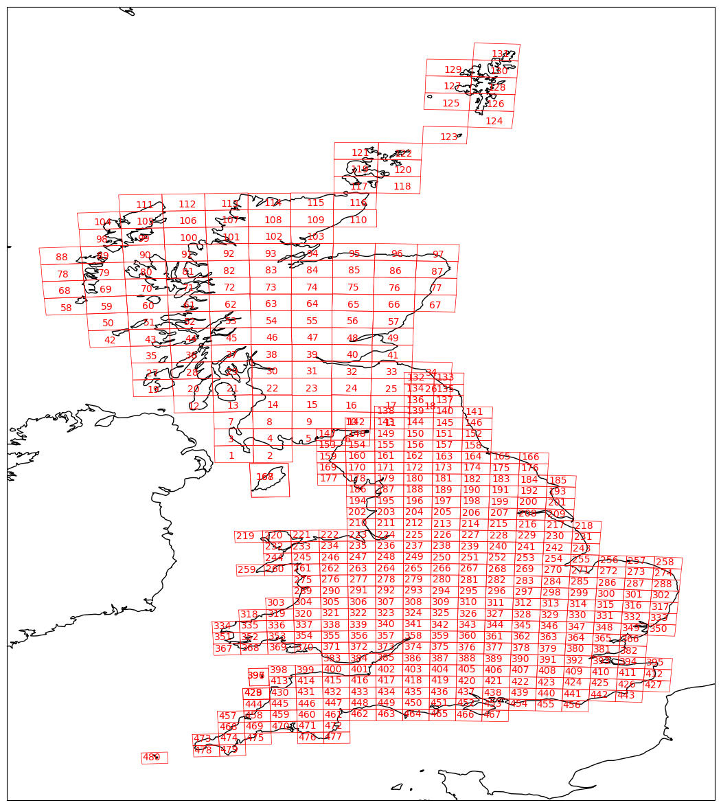

Download
=========

.. todo:: Add comment saying navigate in your terminal to your working directory and then open a notebook from there. Shift right click on a folder in windows to copy path name.
.. todo:: Add instruction to create a new notebook.

.. note:: Run these commands in a Jupyter notebook (or other IDE), ensuring you are in your `mapreader` python environment.

.. note:: You will need to update file paths to reflect your own machines directory structure.

MapReader's ``Download`` subpackage is primarily used to download files (e.g. map images and metadata) stored remotely and contains two methods of downloading these files:

- :ref:`Via_TileServer` - an open-source map server
- :ref:`Via_Azure` - Microsoft's cloud storage

If you already have your maps stored locally: skip this section and proceed on to the `Load <https://mapreader.readthedocs.io/en/latest/User-guide/Load.html>`__ part of the User Guide.

If you have maps stored in a different cloud storage service, please refer to documentation for that service.

.. _Via_TileServer:

Via TileServer_
----------------

To download maps from TileServer_, you will need to tell MapReader which map tiles to download.
This is done by providing MapReader with a metadata file (usually a ``json`` file), which contains information about your desired maps/map series and a download URL pointing to the tileset of these maps.

Some example metadata files, corresponding to the `OS one-inch 2nd edition maps <https://mapseries-tilesets.s3.amazonaws.com/1inch_2nd_ed/index.html>`_ and `OS six-inch 1st edition maps for Scotland <https://mapseries-tilesets.s3.amazonaws.com/os/6inchfirst/index.html>`_, are provided in ``MapReader/worked_examples/persistent_data``.

.. todo:: include list of requirements of json metadata file, and what form those fields should take (e.g. coordinates) (Rosie)

.. todo:: explain what json file does (allows splitting layer into 'map sheets'), allows patches to retain attributes of parent maps to investigate at any point of pipeline (Katie)

To set up your download, create a ``TileServer`` object and specify ``metadata_path`` (the path to your ``metadata.json`` file) and ``download_url`` (the XYZ URL for your tileset): 

.. code-block:: python

     from mapreader import TileServer

     my_ts = TileServer(
         metadata_path="path/to/metadata.json",
         download_url="mapseries-tilesets.your_URL_here/{z}/{x}/{y}.png",
     )

e.g. for the OS one-inch maps (detailed above):

.. code-block:: python

     #EXAMPLE
     my_ts = TileServer(
         metadata_path="~/MapReader/mapreader/worked_examples/persistent_data/metadata_OS_One_Inch_GB_WFS_light.json",
         download_url="https://mapseries-tilesets.s3.amazonaws.com/1inch_2nd_ed/{z}/{x}/{y}.png",
     )

This creates a TileServer object (``my_ts``) which contains information, pulled from your metadata file, about the maps/map series you'd like to download. 
Its ``.metadata`` attribute is a dictionary containing this information and can be used to explore your maps/map series.

For example, to plot a histogram of the publication dates of all maps included in your metadata, use: 

.. code-block:: python

     my_ts.hist_published_dates()

.. image:: ../figures/hist_published_dates.png
     :width: 400px
     :align: center

Or, to visualise the boundaries of all maps included in your metadata, use: 

.. code-block:: python

     my_ts.plot_metadata_on_map(add_text=True)

MapReader uses coordinate-based queries to help you find and select which map tiles to download. 

To find valid ranges of latitudes and longitudes to use for querying, you can find the minimum and maximum of latitudes and longitudes of all maps included in your metadata using:

.. code-block:: python

     my_ts.minmax_latlon()

Then, to create a query and return map tiles which contain your queried coordinates, use: 

.. code-block:: python

     my_ts.query_point([lat, lon])
     my_ts.print_found_queries()

or: 

.. code-block:: python

     my_ts.query_point([[lat1, lon1], [lat2, lon2], ...])
     my_ts.print_found_queries()

By default, only the results of the most recent query will be stored in memory. 
This can be changed, by specifying ``append = True``, thereby allowing multiple query results to be stored and accessed.

e.g.: 

.. code-block:: python

     #EXAMPLE
     my_ts.query_point([55.9, -4.2])
     my_ts.query_point([57.1, -2.5], append=True)
     my_ts.query_point([56.4, -3.5], append=True)
     my_ts.print_found_queries()

Finally, to download map tiles from TileServer_, use: 

.. code-block:: python

     my_ts.download_tileserver()

By default, this downloads map tiles as ``png`` files and saves them to a newly created ``./maps`` directory.
Metadata is also saved there as a ``csv`` file named ``metadata.csv``.
MapReader will, therefore, create the following directory structure:

::

    project
    ├──your_notebook.ipynb
    └──maps        
        ├── map1.png
        ├── map2.png
        ├── map3.png
        ├── ...
        └── metadata.csv

If you would like to set this up differently, the output paths/names can be changed by specifying ``output_maps_dirname`` and ``output_metadata_filename``: 

.. code-block:: python

     my_ts.download_tileserver(
         output_maps_dirname="./my_downloaded_maps",
         output_metadata_filename="my_metadata_file.csv",
     )

This will create the following directory structure:

::

    project
    ├──your_notebook.ipynb
    └──my_downloaded_maps        
        ├── map1.png
        ├── map2.png
        ├── map3.png
        ├── ...
        └── my_metadata_file.csv

When downloading your maps, you can also set the zoom level (default = 14) by specifying ``zoom_level`` and adjust the numbers of pixels in your tiles by specifying ``pixel_closest``.

Furthermore, although by default ``.download_tilserver()`` downloads only queried maps (i.e. those returned by ``my_ts.print_found_queries()``), it can be set to download all map tiles covered by the coordinates within your metadata using ``mode = "all"``:

.. code-block:: python

     my_ts.download_tileserver(mode="all")

.. _Via_Azure:

Via Azure-Blob-Storage_
-------------------------

.. comment: TODO provide example command for pulling data from azure storage container (azure access command)

TBC

.. _TileServer: http://tileserver.org/
.. _Azure-Blob-Storage: https://azure.microsoft.com/en-gb/products/storage/blobs/ 
