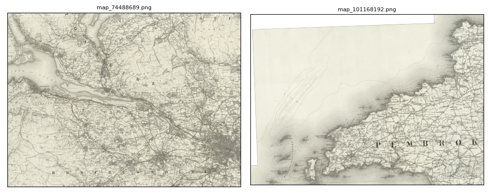
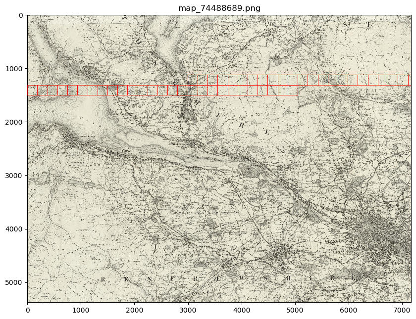
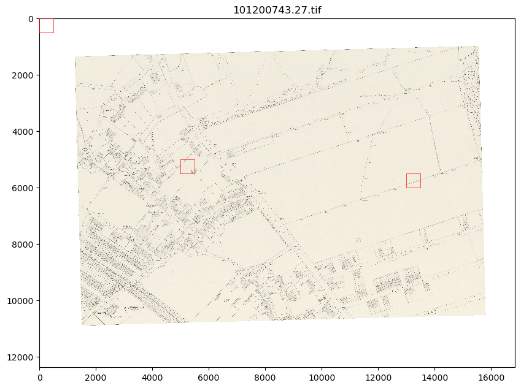
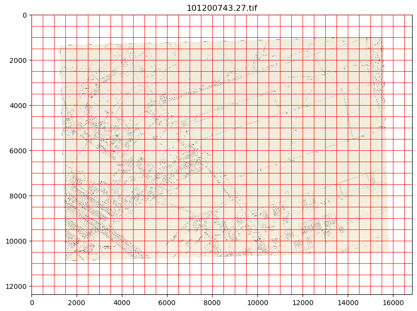
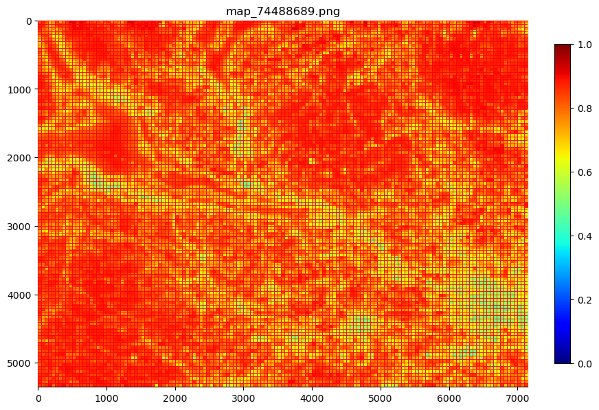
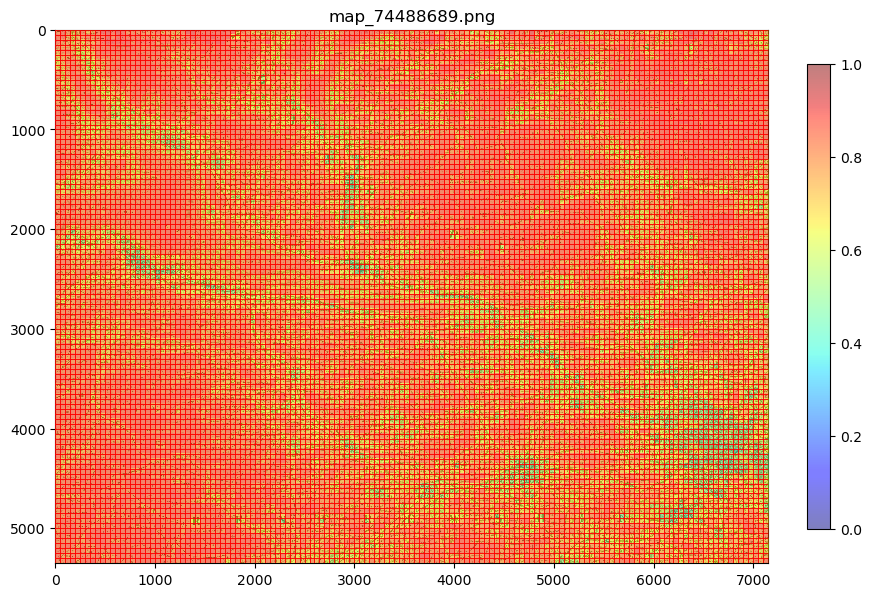

Load
=====

Load
-----

MapReader's loader package is used to load, visualise and patchify images (e.g. maps). 
Images (e.g. png, jpeg, tiff or geotiff files) can be loaded in using: 

.. code :: python

    from mapreader import loader
    my_files = loader("./path/to/files")

This creates a mapImages object (``my_files``) which contains information about your images. 
To see the contents of this object, use: 

.. code :: python

    print(my_files)

You will see that your images are labelled as either parents or children.
This naming structure is useful later on in the MapReader pipeline as it allows you to distinguish parent images (i.e. whole images) and child images (i.e. patches) as well as identify which parent image each patch has come from.

If your images contain metadata (e.g. if you have loaded geotiff files), you can add this into your mapImages object using:

.. code :: python

    my_files.addGeoInfo()

Or, if you have a separate metadata (e.g. in the form of a pd.DataFrame or a .csv file), use: 

.. code :: python

    my_files.add_metadata(metadata="./path/to/metadata.csv")

Patchify 
----------

Once you've loaded in all your data, you'll then need to patchify your images (i.e. slice them into a grid of smaller patches).
This can be done using: 

.. code :: python

    my_files.sliceAll()

By default, this slices images into 100 x 100 pixel patches which are saved in a newly created directory called ``./tests``. This save directory can be changed by specifying ``path_save``.

e.g. :

.. code :: python

    my_files.sliceAll(path_save="./path/to/directory")

If you have loaded geographic coordinates into your mapImages object, you can specify ``method`` and ``slice_size`` to slice your images by meters instead of pixels.

e.g. :

.. code :: python

    my_files.sliceAll(method="meters", slice_size=1)

After patchifying, you'll see that ``print(my_files)`` shows you have both parents and children (patches).
To view an iterable list of these, you can use the ``.list_parents()`` and ``.list_children()`` methods: 

.. code :: python

    parent_list=my_files.list_parents()
    child_list=my_files.list_children()

    print(parent_list)
    print(child_list[0:5]) # too many to print them all!

Or, to view these in a dataframe, use:

.. code :: python

    parent_df, patch_df = my_files.convertImages()
    patch_df.head()

.. note:: parent and patch dataframes will not automatically update so you may want to run this command again if you add new information into your mapImages object.

Visualise
----------

To view a random sample of your images, use: 

.. code :: python

    my_files.show_sample(num_samples=3)

By default, this will show you a random sample of your parent images.
To see a random sample of your patches (child images) use the ``tree_level = "child"`` argument: 

.. code :: python

    my_files.show_sample(num_samples=3, tree_level="child")

.. image:: ../figures/show_sample_child.png
    :width: 400px

It can also be helpful to see your patches (child images) in the context of their parent image. To do this use the ``.show()`` method. 

e.g. :

.. code :: python

    my_files.show(child_list[250:300])

or 

.. code :: python

    files_to_show=[child_list[0], child_list[350], child_list[400]]
    my_files.show(files_to_show)

This will show you your chosen patches, by default highlighted with red borders, in the context of their parent image. 

You may also want to see all the patches created from one of your parent images.
This can be done using: 

.. code :: python

    my_files.show_par(parent_list[0])

Further analysis/visualisation  
--------------------------------

If you have loaded geographic coordinates into your mapImages object, you may want to calculate the coordinates of your patches. The ``.add_center_coord()`` method can used to do this:

.. code :: python

    my_files.add_center_coord()

The ``.calc_pixel_stats()`` method can be used to calculate means and standard deviations of pixel intensites of each patch (child image) and parent image:

.. code :: python

    my_files.calc_pixel_stats()

Specific values (e.g. 'mean_pixel_RGB') can be visualised using the ``.show()`` and ``.show_par()`` methods by specifying the ``value``, ``vmin`` and ``vmax`` arguments.

e.g. :

.. code :: python

    value='mean_pixel_RGB'
    vmin=patch_df[value].min()
    vmax=patch_df[value].max()
    
    my_files.show_par(parent_list[0], value=value, vmin=vmin, vmax=vmax)

You may also want to specify the ``alpha`` argument, which sets the transparency of your plotted values. Lower ``alpha`` values allow you to see the parent image underneath:

.. code :: python

    my_files.show_par(parent_list[0], value=value, vmin=vmin, vmax=vmax, alpha=0.5)

