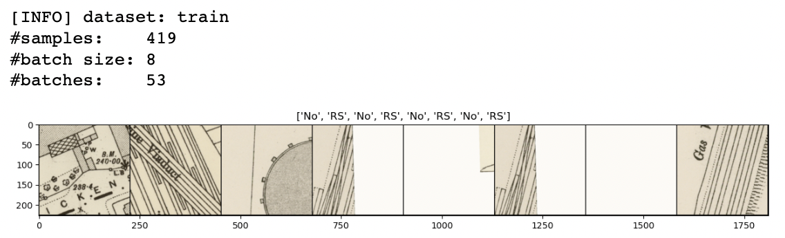
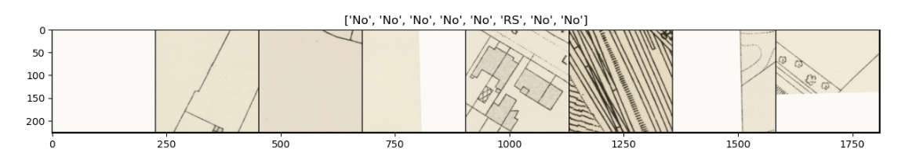

Learn and Predict
==================

.. note:: Run these commands in a Jupyter notebook (or other IDE), ensuring you are in your `mapreader` python environment.

.. note:: You will need to update file paths to reflect your own machines directory structure.

MapReader's ``Learn`` subpackage is used to train or fine-tune a CV (computer vision) classifier and use it for inference.

Load data
-----------

Load annotations
~~~~~~~~~~~~~~~~~~

First, load in your annotations and images using:

.. code-block:: python

    from mapreader import loadAnnotations

    annotated_images = loadAnnotations()
    annotated_images.load("./path/to/annotations.csv", path2dir="./path/to/patches/*.png")

For example, if you have downloaded your maps using the default settings of our ``Download`` subpackage or have set up your directory as reccommended in our `Input Guidance <https://mapreader.readthedocs.io/en/latest/Input-guidance.html>`__, and then saved your patches and annotations using the default settings:

.. code-block:: python

    #EXAMPLE
    annotated_images = loadAnnotations()
    annotated_images.load("./annotations_one_inch/rail_space_#rosie#.csv", path2dir="./patches/patch-*png")

To view the data loaded in from your ``csv`` as a dataframe, use:

.. code-block:: python

    annotated_images.annotations

And, to view a summary of your annotations, use: 

.. code-block:: python

    print(annotated_images)

To align with python indexing, you may want to shift your labels so they start at 0. 
This can be done using:

.. code-block:: python

    annotated_images.adjust_label(shiftby=-1)

You can then view a sample of your annotated images using the ``show_image_labels()`` method.
The ``tar_label`` argument specifies which label you would like to show. 

For example, to show label no. 1 (i.e. "rail_space"):

.. code-block:: python

    #EXAMPLE
    annotated_images.show_image_labels(tar_label=1)

.. image:: ../figures/show_image_labels_10.png
    :width: 400px

By default, this will show you a sample of 10 images, but this can be changed by specifying ``num_sample``. 

You can also view specific images from their indices using:

.. code-block:: python

    annotated_images.show_image(indx=14)

.. image:: ../figures/show_image.png
    :width: 400px

You may also notice that, when viewing a sample of your annotations, you have mislabelled one of your images.
The ``.review_labels()`` method, which returns an interactive tool for adjusting your annotations, provides an easy way to fix this:

.. code-block:: python

    annotated_images.review_labels()

.. image:: ../figures/review_labels.png
    :width: 400px

.. note:: To exit, type "exit" into the text box.

Split annotations
~~~~~~~~~~~~~~~~~~

Before training your CV classifier, you first need to split your annotated images into a 'train', 'validate' and, optionally, 'test' sets.
MapReader uses a stratified method to do this, such that each set contains approximately the same percentage of samples of each target label as the original set.

To split your annotated images into dataframes, use: 

.. code-block:: python

    annotated_images.split_annotations()

By default, your annotated images will be split as follows:

-    70% train
-    15% validate
-    15% test

However, these ratios can be changed by specifying ``frac_train``, ``frac_val`` and ``fract_test``.

e.g. the following command will result in a split of 50% (train), 20% (val) and 30% (test): 

.. code-block:: python

    #EXAMPLE
    annotated_images.split_annotations(frac_train=0.5, frac_val=0.2, frac_test=0.3)

You can then check how many annotated images are in each set by checking the value counts of your dataframes:

.. code-block:: python

    train_count = annotated_images.train["label"].value_counts()
    val_count = annotated_images.val["label"].value_counts()
    test_count = annotated_images.test["label"].value_counts()

    print(train_count)
    print(val_count)
    print(test_count)

Prepare images (transform) and datasets
~~~~~~~~~~~~~~~~~~~~~~~~~~~~~~~~~~~~~~~~

.. todo:: "Most neural networks expect the images of a fixed size. Therefore, we will need to write some preprocessing code." Add note about this is why we resize and also comment on square images.

Before using your images in training, validation or inference, you will first want to prepare your images using image transformations.
This can be done by using `torchvision's transformms module <https://pytorch.org/vision/stable/transforms.html>`_. 

e.g. :

.. code-block:: python

    #EXAMPLE
    from mapreader import patchTorchDataset
    from torchvision import transforms

    resize = 224
    # we are using ImageNet's mean/std RGB values here - you can change these to reflect those of your own dataset if you like
    normalize_mean = [0.485, 0.456, 0.406]
    normalize_std = [0.229, 0.224, 0.225]

    data_transforms = transforms.Compose(
        [
            transforms.Resize(resize),
            transforms.ToTensor(),
            transforms.Normalize(normalize_mean, normalize_std),
        ]
    )

Then, to apply these transformations to the images within your 'train', 'validate' and 'test' sets, pass your ``data_transforms`` to MapReader's ``patchTorchDataset`` class:    

.. code-block:: python

    train_dataset = patchTorchDataset(annotated_images.train, data_transforms)
    val_dataset = patchTorchDataset(annotated_images.val, data_transforms)
    test_dataset = patchTorchDataset(annotated_images.test, data_transforms)

This creates three transformed datasets (``train_dataset``, ``val_dataset`` and ``test_dataset``), ready for use, which can be viewed as dataframes using the ``.patchframe`` attribute:

.. code-block:: python

    your_dataset.patchframe

e.g. :

.. code-block:: python

    #EXAMPLE
    train_dataset.patchframe

Initilise ``classifier()``
~~~~~~~~~~~~~~~~~~~~~~~~~~~

MapReader's ``classifier()`` class is used to:

- Generate batches from your datasets (create DataLoader).
- Define models (initialise a pre-existing model or build your own).
- Define a loss functions, optimisers and schedulers.
- Train and test models.
- Predict classes (model inference).
- Visualise datasets and predictions.

You can initialise a ``classifier()`` object (``my_classifier``) using:

.. code-block:: python

    from mapreader import classifier

    my_classifier = classifier()

You should then follow the steps below to load in your datasets and add a model.

Define samplers and generate batches
~~~~~~~~~~~~~~~~~~~~~~~~~~~~~~~~~~~~~

When training/fine-tuning a model, datasets are broken down into smaller batches which can be looped through one at a time.
This helps speed up the learning process and reduces memory requirements.

To create batches from your datasets, use: 

.. code-block:: python

    my_classifier.add2dataloader(your_dataset)

By default, this will create shuffled batches, each containing 16 map images.

In many cases, you may want to create batches which are ~ representative of your whole dataset.  
This is particularly important for inbalanced datasets (i.e. those which contain different numbers of each label). 
Sampler, with weights inversely proportional to the number of instances of each label within each dataset, are used to do this.

Before defining your samplers, you must first find the numbers of instances of each label in each of your datasets. 
This can be done using: 

.. code-block:: python

    import numpy as np
    import torch

    train_count_list = train_dataset.patchframe["label"].value_counts().to_list()
    val_count_list = val_dataset.patchframe["label"].value_counts().to_list()

You can then use the reciprocals of these as weights for your samplers:

.. code-block:: python

    weights = np.reciprocal(torch.Tensor(train_count_list))
    weights = weights.double()

    train_sampler = torch.utils.data.sampler.WeightedRandomSampler(
        weights[train_dataset.patchframe["label"].to_list()],
        num_samples=sum(train_count_list),
    )
    
    val_sampler = torch.utils.data.sampler.WeightedRandomSampler(
        weights[val_dataset.patchframe["label"].to_list()], 
        num_samples=sum(val_count_list)
    )

To create batches from your datasets using your samplers, pass the ``sampler`` argument to the ``add2dataloader()`` method.

e.g. :

.. code-block:: python

    #EXAMPLE
    my_classifier.add2dataloader(
        train_dataset, 
        sampler=train_sampler, 
        shuffle=False
    )

You may also want to change the batch size or specify the name of your datasets using the ``batch_size`` and ``set_name`` arguments, respectively.

e.g. :

.. code-block:: python

    #EXAMPLE
    batch_size = 8

    my_classifier.add2dataloader(
        train_dataset,
        sest_name="train",
        batch_size=batch_size,
        sampler=train_sampler,
        shuffle=False,
    )
    my_classifier.add2dataloader(
        val_dataset,
        set_name="val",
        batch_size=batch_size,
        sampler=val_sampler,
        shuffle=False,
    )
    my_classifier.add2dataloader(
        test_dataset, set_name="test", batch_size=batch_size, shuffle=False
    )

After loading your datasets into your ``classifier`` object and creating your batches, you can see information about them using:

.. code-block:: python

    my_classifier.dataset_sizes

To see information about each dataset individually, use:

.. code-block:: python 

    my_classifier.batch_info(set_name="train")
    my_classifier.batch_info(set_name="val")
    my_classifier.batch_info(set_name="test")

and 

.. code-block:: python

    my_classifier.print_classes_dl(set_name="train")
    my_classifier.print_classes_dl(set_name="val")
    my_classifier.print_classes_dl(set_name="test")

These return information about the batches and labels within each dataset, respectively. 

.. note:: This only works if you have specified ``set_name`` when adding your datasets to the dataloader.

You should also set ``class_names`` to help with human-readability. 
This is done by defining a dictionary mapping each label to a new name. 

e.g. using the railspace example from before:

.. code-block:: python

    #EXAMPLE
    class_names = {0: "no_rail_space", 1: "rail_space"}
    my_classifier.set_classnames(class_names)
    my_classifier.print_classes_dl()

Then, to see a sample batch, use the ``.show_sample()`` method:

.. code-block:: python

    my_classifier.show_sample()

By default, this will show you the first batch created from your 'train' datasest, along with corresponding batch information (i.e. ``.batch_info()``).
The ``batch_number`` and ``set_name``  arguments can be used to show different batches and datasets, respectively. 

e.g. to see a sample of the third batch of your "val" dataset:

.. code-block:: python

    #EXAMPLE
    my_classifier.show_sample(set_name="val", batch_number=3)

Option 1 - Fine-tune a pretrained model
-----------------------------------------

.. note:: if you are using your own (already fine-tuned) model, skip to Option 2

Load a PyTorch model
~~~~~~~~~~~~~~~~~~~~~~

The `torchvision.models <https://pytorch.org/vision/stable/models.html>`__ subpackage contains a number of pre-trained models which can be loaded into your ``classifier()`` object.
These can be added in one of two ways:

    1.  Import a model directly from ``torchvision.models`` and then add to your ``classifier()`` object using ``.add_model()``. 
        
        e.g. to load "resnet18":

        .. code-block:: python

            #EXAMPLE
            from torchvision import models
            from torch import nn

            my_model = models.resnet18(pretrained=True)

            # reshape the final layer (FC layer) of the neural network to output the same number of nodes as classes as in your dataset
            num_input_features = my_model.fc.in_features
            my_model.fc = nn.Linear(num_input_features, my_classifier.num_classes)

            my_classifier.add_model(my_model)

    2.  Add a model directly using ``.initialize_model()``.
        
        e.g. to load "resnet18":

        .. code-block:: python
        
            #EXAMPLE
            my_classifier.initialize_model("resnet18")
    
        By default, this will initiliase a pretrained model and reshape the last layer to output the same number of nodes as classes in your dataset (as above). 

Initialise optimiser and scheduler
^^^^^^^^^^^^^^^^^^^^^^^^^^^^^^^^^^^^

When training/fine-tuning your model, you can either use one learning rate for all layers in your neural network or define layerwise learning rates (i.e. different learning rates for each layer in your neural network). 
Normally, when fine-tuning pre-trained models, layerwise learning rates are favoured, with smaller learning rates assigned to the first layers and larger learning rates assigned to later layers.

To define a list of parameters to optimise within each layer, with learning rates defined for each parameter, use:

.. code-block:: python 
    
    parameters_to_optimise = my_classifier.layerwise_lr(min_lr=1e-4, max_lr=1e-3)

By default, a linear function is used to distribute the learning rates (using ``min_lr`` for the first layer and ``max_lr`` for the last layer). 
This can be changed to a logarithmic function by specifying ``ltype="geomspace"``.

You should then pass this list to your ``classifier()`` using:

.. code-block:: python

    my_classifier.initialize_optimizer(params2optim=parameters_to_optimise)

As well as an optimiser, you should initialise a scheduler (which defines how often to adjust your learning rates during training) and a criterion (which works out how well your model is performing and therefore how much to adjust your parameters). 
This is done using ``.initialize_scheduler()`` and ``.add_criterion()`` respectively:

.. code-block:: python

    my_classifier.initialize_scheduler()

    criterion = torch.nn.CrossEntropyLoss()
    my_classifier.add_criterion(criterion)

By default, your scheduler will be set up to adjust your learning rates every 10 epochs. This can be adjusted by specifying ``scheduler_param_dict``.

We have used `PyTorch's cross-entropy loss function <https://pytorch.org/docs/stable/generated/torch.nn.CrossEntropyLoss.html>`_ as our criterion. 
You can change this if you would like.

`See this tutorial for further details on fine-tuning torchvision models <https://pytorch.org/tutorials/beginner/finetuning_torchvision_models_tutorial.html>`_

Train/fine-tune your model
~~~~~~~~~~~~~~~~~~~~~~~~~~~~

To begin training/fine-tuning your model, use:

.. code-block:: python

    my_classifier.train()

By default, this will run 25 epochs of training and validating your model and save your model in a newly created ``./models`` directory. 
The ``num_epochs`` and ``save_model_dir`` arguments can be specified to change these.

e.g. to run 10 epochs of training and save your model in a newly created ``my_models_directory``:

.. code-block:: python

    #EXAMPLE
    my_classifier.train(num_epochs=10, save_model_dir="./my_models_directory")

Other arguments you may want to specify when training your model include:

- ``phases``: phases to perform at each epoch
- ``tensorboard_path``: directory to save tensorboard files
- ``verbosity_level``: -1 (quiet), 0 (normal), 1 (verbose), 2 (very verbose), 3 (debug)

Plot metrics
^^^^^^^^^^^^^^

Metrics are stored in a dictionary accesible via your ``classifier()`` objects ``.metrics`` attribute. 
To list these metrics, use:

.. code-block:: python

    list(myclassifier.metrics.keys())

To view specific metrics from training/validating, use:

.. code-block:: python

    my_classifier.metrics["metric_to_view"]

e.g. :

.. code-block:: python

    #EXAMPLE
    my_classifier.metrics["epoch_fscore_micro_train"]

Or, to help visualise the progress of your training, metrics can be plotted using ``.plot_metric()``: 

.. code-block:: python

    #EXAMPLE
    my_classifier.plot_metric(
        y_axis=["epoch_loss_train", "epoch_loss_val"],
        y_label="Loss",
        legends=["Train", "Valid"],
    )

.. image:: ../figures/loss.png
    :width: 400px

Option 2 - Load your own fine-tuned model 
--------------------------------------------

Load your model
~~~~~~~~~~~~~~~~~

If you are using your own model, you can simply load it into your ``classifier()`` object using:

.. code-block:: python

    my_classifier.load("./path/to/model.pkl")

e.g. to load the model you created and saved earlier:

.. code-block:: python

    #EXAMPLE
    my_classifier.load("models/model_checkpoint_8.pkl")

Inference 
-----------

Finally, to use your model for inference, use:

.. code-block:: python

    my_classifier.inference(set_name="your_dataset_name")

e.g. to run the trained model on the 'test' dataset, use:

.. code-block:: python

    #EXAMPLE
    my_classifier.inference(set_name="test")

By default, metrics will not be calculated or added to the ``.metrics`` dictionary during inference.
So, to add these in so that they can be viewed and plotted, use ``.calculate_add_metrics()``. 

e.g. to add metrics for the 'test' dataset: 

.. code-block:: python

    #EXAMPLE
    my_classifier.calculate_add_metrics(
        y_true=my_classifier.orig_label,
        y_pred=my_classifier.pred_label,
        y_score=my_classifier.pred_conf,
        phase="test",
    )

Metrics from this inference can then be viewed as above. 

To see a sample of your inference results, use: 

.. code-block:: python

    my_classifier.inference_sample_results(set_name="your_dataset_name")

e.g. :

.. code-block:: python

    #EXAMPLE
    my_classifier.inference_sample_results(set_name="test")

.. image:: ../figures/inference_sample_results.png
    :width: 400px

By default, this will show you 6 samples of your first class (label). 
The ``num_samples`` and ``class_index`` arguments can be specified to change this.

You may also want specify the minimum (and maximum) prediction confidence for your samples. 
This can be done using ``min_conf`` and ``max_conf``.

e.g. :

.. code-block:: python

    #EXAMPLE
    my_classifier.inference_sample_results(
        set_name="test", num_samples=3, class_index=1, min_conf=80
    )
