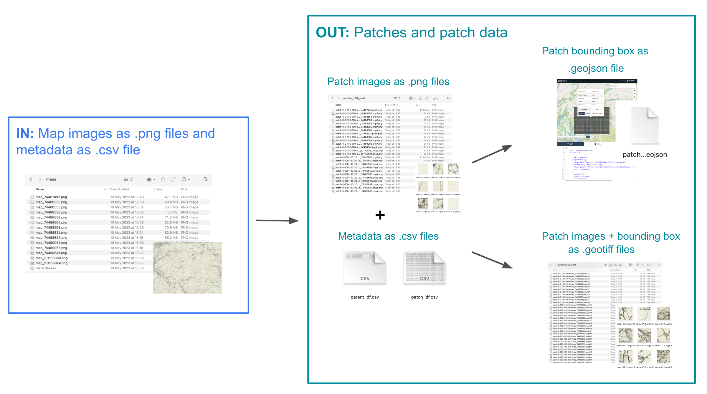

What is MapReader?
===================

MapReader is an end-to-end computer vision (CV) pipeline for exploring and analyzing images at scale.

What is unique about MapReader?
--------------------------------

MapReader is based on the 'patchwork method' in which whole map images are sliced into a grid of squares or 'patches':

.. image:: ../figures/patchify.png

This unique way of pre-processing map images enables the use of image classification to identify visual features within maps, in order to answer important research questions.

What is 'the MapReader pipeline'?
---------------------------------

The MapReader pipeline consists of a linear sequence of tasks:

.. image:: ../figures/pipeline_explained.png

Together, these tasks can be used to train a computer vision (CV) classifier to recognize visual features within maps and identify patches containing these features across entire map collections.

What kind of visual features can MapReader help me identify?
------------------------------------------------------------

In order to train a CV classifier to recognize visual features within your maps, your features must have a homogeneous visual signal across your map collection (i.e. always be represented in the same way).

What are the inputs and outputs of each stage in the MapReader pipeline?
------------------------------------------------------------------------

Download
^^^^^^^^^
.. image:: ../figures/in_out_download.png
    :width: 600px

Load
^^^^^

Annotate
^^^^^^^^^
.. image:: ../figures/in_out_annotate.png
    :width: 600px

Classify (Train and Predict)
^^^^^^^^^^^^^^^^^^^^^^^^^^^^^^
.. image:: ../figures/in_out_classify.png
    :width: 600px
